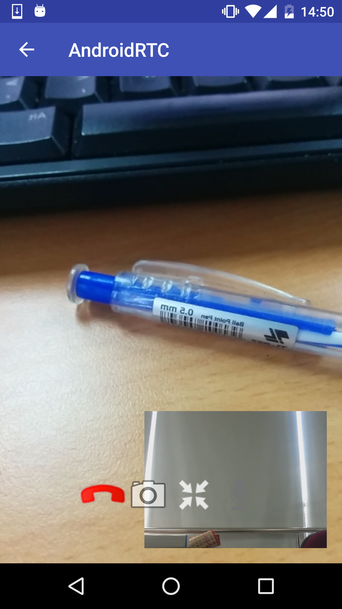

# WebRTC-Android
- Modify code from [Pierre Chabardes](mailto:pierre@chabardes.net)
## Server Config
- Server config from https://github.com/pchab/ProjectRTC
- Deploy server into Heroku at https://murmuring-wildwood-91096.herokuapp.com

## Android Client

## Libraries
- libjingle peerconnection version 11139@aar [Maven]:(https://mvnrepository.com/artifact/io.pristine/libjingle(https://code.google.com/p/webrtc/)

